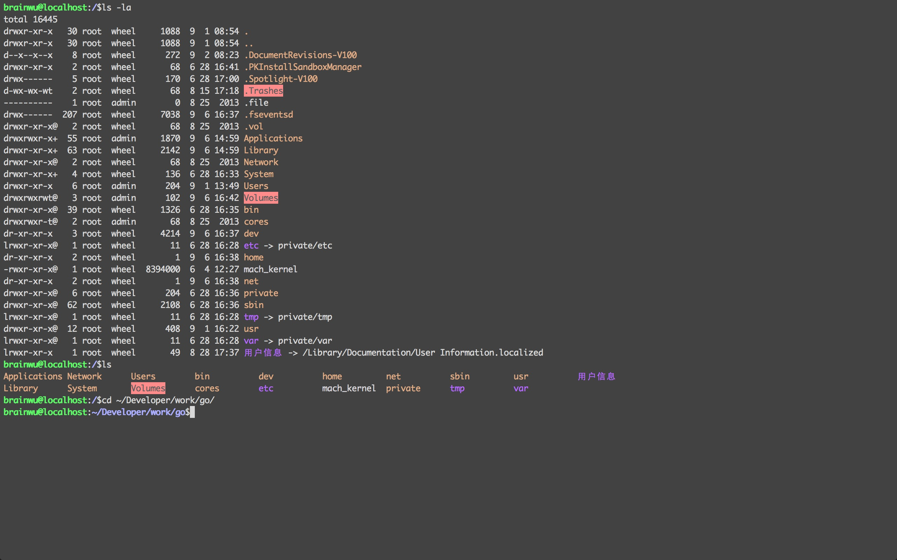

##How to get ?
* git clone https://github.com/brainwu/iterm2-colors.git

##Preparation
* vim ~/.bash_profile 
* Add the following content to ~/.bash_profile
* source ~/.bash_profile
* export CLICOLOR=1
* export LSCOLORS=gxfxcxdxbxegedabagacad
* export PS1='\[\033[01;32m\]\u@\h\[\033[00m\]:\[\033[01;36m\]\w\[\033[00m\]\$'
* export TERM=xterm-256color

##How to use the iterm-color file？
* open iterm
* click Preferences 
* check the colors tab
* click on load presets
* import file named brainwu.itermcolors that you have downloaded.
* click again on load presets and check brainwu.itermcolors.
* over.

##Img

